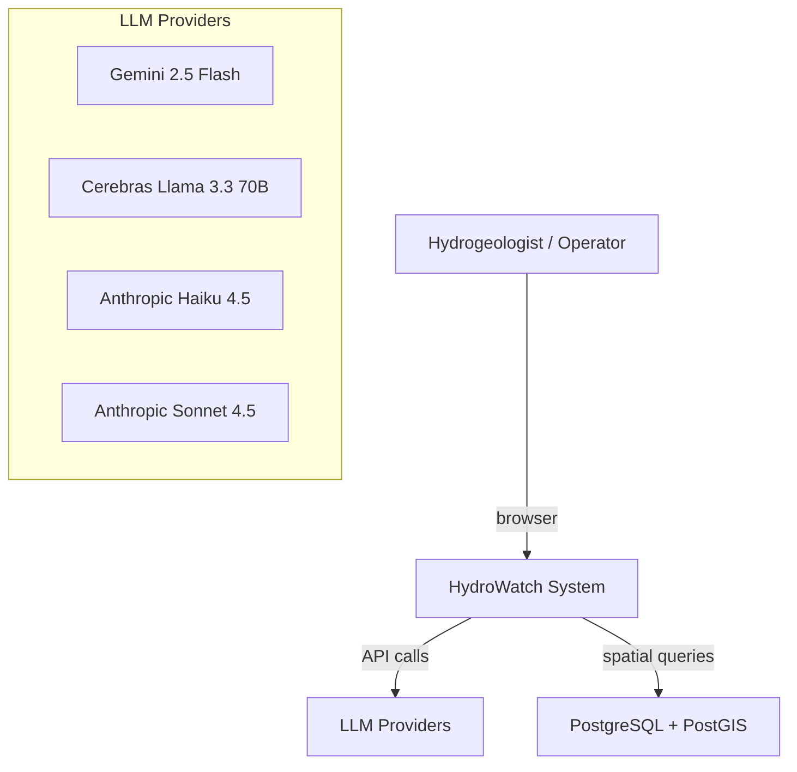
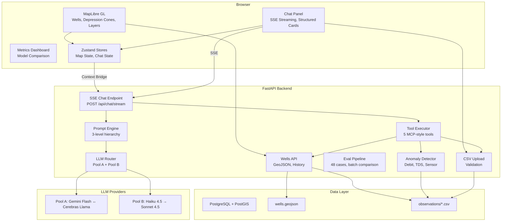
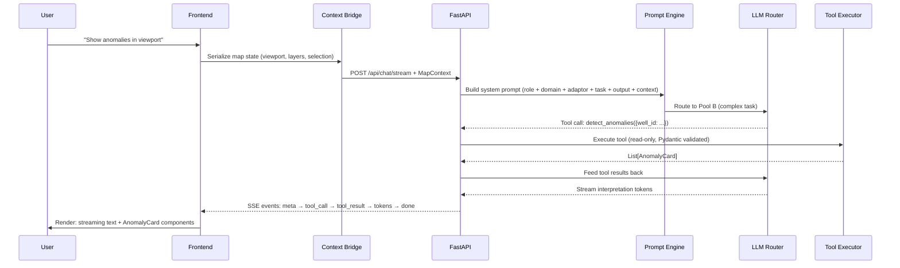

# Architecture

## System Context (C4 Level 1)



## Container Diagram (C4 Level 2)



## Data Flow



## Prompt Engine Architecture

```
Final Prompt = Level 0: Base Role (~200 tokens)
             + Level 1: Domain Knowledge (~600 tokens)
             + Model Adaptor (per provider, ~150 tokens)
             + Task Instructions (per task type, ~200 tokens)
             + Output Format (per response type, ~80 tokens)
             + Level 2: Context Bridge (runtime, variable)
```

Level 1 domain knowledge simulates what a fine-tuned model would know natively. For production, this knowledge would be embedded via fine-tuning; here we inject it as context for faster iteration with the same effect.

## Model Routing

| Pool | Models | Fallback | Tasks |
|------|--------|----------|-------|
| Pool A | Gemini 2.5 Flash ↔ Cerebras Llama 3.3 70B | Mutual | validate_csv, query_wells, get_region_stats, get_well_history |
| Pool B | Anthropic Haiku 4.5 | — | detect_anomalies, interpret_anomaly, general_question |
| Pool B+ | Anthropic Sonnet 4.5 | — | calibration_advice (complex reasoning) |

## Architecture Decision Records

See [docs/adr/](docs/adr/) for detailed rationale behind key technical decisions.
