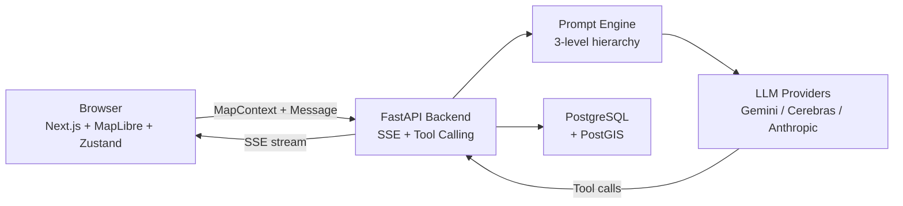

# HydroWatch

[](https://github.com/CreatmanCEO/hydrowatch/actions)
[](https://python.org)
[](https://fastapi.tiangolo.com)
[](LICENSE)
[](#testing)

**AI-powered groundwater monitoring with LLM assistant for anomaly detection in Abu Dhabi aquifer systems.**

> Interactive map with real-time AI analysis of 25 monitoring wells across 4 clusters. Multi-provider LLM routing (Gemini / Cerebras / Anthropic) with domain-specific prompt engineering and structured output for professional hydrogeological decision support.

<!-- TODO: Replace with actual screenshot after first run -->


## Key Features

- **Depression cone detection** — Theis-equation-based drawdown calculation with concentric ring visualization on MapLibre map
- **Multi-provider LLM routing** — Pool A (Gemini Flash / Cerebras Llama, mutual fallback) for simple tasks, Pool B (Anthropic Haiku / Sonnet) for complex reasoning
- **Context-aware AI assistant** — LLM understands current viewport, active layers, and selected well via Context Bridge pattern
- **Anomaly detection** — Automated debit decline, TDS spike, and sensor fault detection with severity classification
- **Structured output** — All LLM responses validated through Pydantic schemas, rendered as typed cards (AnomalyCard, ValidationResult, RegionStats)
- **CSV validation** — Upload and validate groundwater observation files with column checks, range validation, and statistics
- **Model evaluation pipeline** — 48 test cases with accuracy, schema compliance, latency, and cost metrics per model

## Architecture



For detailed diagrams (C4 Level 2, data flow, prompt engine): see [ARCHITECTURE.md](ARCHITECTURE.md)

## Quick Start

### Prerequisites

- Python 3.12+
- Node.js 18+
- Docker (for PostgreSQL + PostGIS)

### Setup

```bash
git clone https://github.com/CreatmanCEO/hydrowatch.git
cd hydrowatch

# Backend
cd backend
python -m venv .venv
source .venv/bin/activate  # Windows: .venv\Scripts\activate
pip install -r requirements.txt

# Generate synthetic data
python -m data_generator.generate_wells
python -m data_generator.generate_timeseries

# Configure API keys
cp ../.env.example ../.env
# Edit .env with your GEMINI_API_KEY, CEREBRAS_API_KEY, ANTHROPIC_API_KEY

# Frontend
cd ../frontend
npm install
```

### Run

```bash
# Terminal 1: Backend
make dev-backend
# or: cd backend && uvicorn main:app --reload --port 8000

# Terminal 2: Frontend
make dev-frontend
# or: cd frontend && npm run dev

# Terminal 3: PostgreSQL (optional, for spatial queries)
make docker-up
```

Open [http://localhost:3000](http://localhost:3000)

### Docker Compose (full stack)

```bash
cp .env.example .env
# Edit .env with API keys
docker compose up -d
```

## API Documentation

Interactive docs available at [http://localhost:8000/docs](http://localhost:8000/docs) (Swagger UI) and [http://localhost:8000/redoc](http://localhost:8000/redoc) (ReDoc).

| Endpoint | Method | Description |
|----------|--------|-------------|
| `/api/chat/stream` | POST | SSE streaming chat with tool calling |
| `/api/wells` | GET | Wells GeoJSON |
| `/api/wells/{id}/history` | GET | Time series with trend analysis |
| `/api/upload/csv` | POST | CSV validation |
| `/api/metrics` | GET | Model evaluation metrics |
| `/api/health` | GET | Health check |

## Tech Stack

| Layer | Technology | Purpose |
|-------|-----------|---------|
| **Backend** | FastAPI, Pydantic v2 | Async API with validated schemas |
| **LLM** | LiteLLM, Instructor | Provider-agnostic routing + structured output |
| **Prompt** | 3-level engine | Role + domain knowledge + model adaptor + task + output format |
| **Frontend** | Next.js 15, TypeScript | SSR + client components |
| **Map** | react-map-gl, MapLibre GL JS | Interactive geospatial visualization |
| **State** | Zustand | Map & chat state with devtools |
| **Streaming** | SSE, @microsoft/fetch-event-source | Token-by-token LLM response streaming |
| **Database** | PostgreSQL + PostGIS, SQLAlchemy | Spatial queries, async ORM |
| **Hydrology** | scipy (Theis equation), numpy | Drawdown calculation, superposition |
| **Eval** | Custom pipeline, DeepEval | 48-case model comparison with metrics |

## Project Structure

```
hydrowatch/
├── backend/
│   ├── main.py                    # FastAPI app, SSE endpoint
│   ├── config.py                  # Pydantic BaseSettings
│   ├── models/                    # Pydantic schemas + SQLAlchemy ORM
│   ├── services/                  # Prompt engine, LLM router, context bridge
│   ├── tools/                     # 5 MCP-style tools (read-only)
│   ├── prompts/                   # Multi-level prompt components
│   ├── data_generator/            # Synthetic well & time series generation
│   ├── eval/                      # Evaluation pipeline + metrics
│   ├── db/                        # Session factory, seed scripts
│   └── tests/                     # 117 tests
├── frontend/
│   └── src/
│       ├── components/Map/        # WellsMap, Popup, DepressionCones, Controls
│       ├── components/Chat/       # ChatPanel, MessageBubble, AnomalyCard, CSVUpload
│       ├── components/Metrics/    # MetricsPanel
│       ├── stores/                # Zustand (mapStore, chatStore)
│       └── lib/                   # API client, context bridge
├── data/                          # Generated wells.geojson + observations/
├── docs/adr/                      # 6 Architecture Decision Records
├── ARCHITECTURE.md                # C4 diagrams, data flow, prompt engine
└── docker-compose.yml             # PostgreSQL + backend + frontend
```

## Testing

```bash
make test
# or: cd backend && python -m pytest tests/ -v
```

117 tests covering: hydro models, data generators, Pydantic schemas, ORM models, tools, tool executor, prompt engine, context bridge, API endpoints, eval pipeline.

## Architecture Decisions

| ADR | Decision | Rationale |
|-----|----------|-----------|
| [0001](docs/adr/0001-litellm-instructor-over-langchain.md) | LiteLLM + Instructor over LangChain | Direct control, minimal abstractions |
| [0002](docs/adr/0002-multi-provider-model-routing.md) | Multi-provider model routing | Cost optimization + resilience |
| [0003](docs/adr/0003-scipy-theis-over-modflow.md) | Theis equation over MODFLOW | 15 lines vs. numerical solver |
| [0004](docs/adr/0004-context-bridge-pattern.md) | Context Bridge pattern | Map-aware LLM responses |
| [0005](docs/adr/0005-synthetic-data-with-anomaly-injection.md) | Synthetic data with anomaly injection | Reproducible, ground truth for eval |
| [0006](docs/adr/0006-sse-over-websocket.md) | SSE over WebSocket | Simpler, sufficient for LLM streaming |

## Eval & Metrics

The evaluation pipeline compares model quality across 48 test cases (CSV validation, anomaly detection, well queries, region analysis, edge cases).

Metrics per model: accuracy (correct tool call), schema compliance (Pydantic validation), latency p50/p95, cost per request, error rate.

Access the metrics dashboard via the **Metrics** tab in the chat panel, or `GET /api/metrics`.

## License

[MIT](LICENSE) - Nikolay Podolyak
