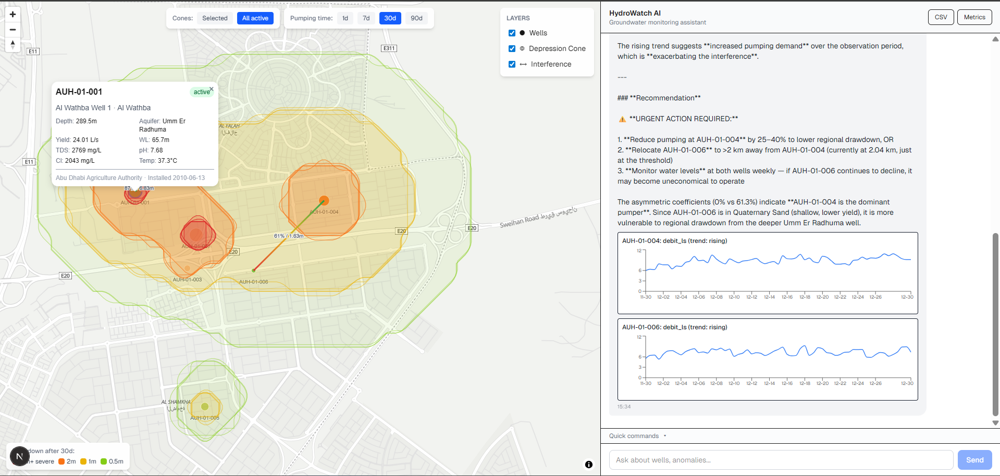
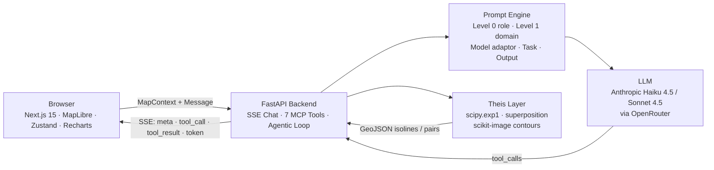

# HydroWatch

[](https://github.com/CreatmanCEO/hydrowatch/actions/workflows/test.yml)
[](https://github.com/CreatmanCEO/hydrowatch/actions/workflows/lint.yml)
[](https://python.org)
[](https://fastapi.tiangolo.com)
[](https://nextjs.org)
[](LICENSE)

**Theis-based groundwater monitoring with LLM assistant for well interference and depression cone analysis in Abu Dhabi aquifer systems.**

> Interactive MapLibre map with real-time hydrogeological analysis: gradient interference lines showing donor/victim relationships between wells, time-variable Theis depression cones, and an AI agent that calls 7 MCP-style tools to answer professional questions with structured output cards.



---

## What it actually does

This is not a dashboard with cosmetic icons. Every visual element comes from real hydrogeology:

- **Interference lines** are computed from the Theis equation. The colour gradient along each line shows asymmetric drawdown coefficients — a red end means "neighbour dominates here, this well is the victim", a green end means "minimally affected, this well is the donor". The label `87% / 6.83m` is the maximum coefficient and combined drawdown at the midpoint.

- **Depression cones** are real Theis-based isolines (0.5 m, 1 m, 2 m, 5 m drawdown), generated server-side via `scipy.special.exp1` plus marching-squares contour extraction (scikit-image). Time slider lets you see cone evolution after 1, 7, 30 or 90 days of pumping. Cones include superposition contributions from any neighbour within 5 km.

- **AI assistant** uses 7 MCP-style tools (`analyze_interference`, `compute_drawdown_grid`, `query_wells`, `get_well_history`, `detect_anomalies`, `get_region_stats`, `validate_csv`). The agent loop calls tools sequentially: a question like "analyse depression cones in this area" triggers `query_wells → analyze_interference → 4× compute_drawdown_grid` and produces a multi-page recommendation with severity-tagged actions.

## Key Features

- **Theis-based interference analysis** — asymmetric coefficients (donor/victim), severity classification (low / medium / high / critical), Theis-driven recommendations
- **Theis depression cones** — real isoline polygons via scipy contour extraction, time-variable (1d/7d/30d/90d), per-well or all-active modes
- **Agentic tool calling** — bounded loop (max 6 iterations) where LLM chains tool calls until reaching a textual answer; supports complex multi-step analyses out of the box
- **Context bridge** — map state (viewport, layers, selected well, cone time, interference visibility) is serialised into every LLM prompt so the agent answers about *what the user is looking at*, not generic data
- **Structured output cards** — `InterferenceCard` (top concerns + regional pattern), `DrawdownCard` (max drawdown + radius + interfering wells), `AnomalyCard`, `WellHistoryChart` (Recharts time-series), all rendered in chat
- **Anomaly detection** — debit decline (Q1 vs Q4 regression), TDS spike (3σ z-score), sensor fault (zero runs); severity-differentiated recommendations
- **Multi-provider LLM routing** — primary Anthropic Haiku 4.5 via OpenRouter; pool-b-upgrade Sonnet 4.5 for deep reasoning; LiteLLM Router with latency-based selection and `--num-retries`
- **Eval pipeline** — 48 test cases across 5 categories; per-model accuracy, schema compliance, latency p50/p95, cost; live progress polling on Run Eval

## Architecture



For C4 Level 2, data flow sequence and prompt engine layout: [ARCHITECTURE.md](ARCHITECTURE.md).
For decisions and rationale: [docs/adr/](docs/adr/).
For Theis-redesign details: [docs/plans/2026-04-20-theis-interference-redesign-design.md](docs/plans/2026-04-20-theis-interference-redesign-design.md).

## Quick Start

### Prerequisites

- Python 3.12+
- Node.js 18+
- An OpenRouter API key (sk-or-...) with access to Anthropic Claude Haiku 4.5
- Optional: Docker (only if you want PostgreSQL + PostGIS for spatial queries; not required for the demo flow)

### Setup

```bash
git clone https://github.com/CreatmanCEO/hydrowatch.git
cd hydrowatch

# Backend
cd backend
python -m venv .venv
source .venv/bin/activate     # Windows cmd: .venv\Scripts\activate
pip install -r requirements.txt

# Generate synthetic wells (25 wells × 4 clusters) and 365-day time series
python -m data_generator.generate_wells
python -m data_generator.generate_timeseries

# Configure API key
cd ..
cp .env.example .env
# Edit .env: OPENROUTER_API_KEY=sk-or-...

# Frontend
cd frontend
npm install
```

### Run

```bash
# Terminal 1: Backend
cd backend && uvicorn main:app --reload --port 8000

# Terminal 2: Frontend
cd frontend && npm run dev
```

Open [http://localhost:3000](http://localhost:3000).

> **Windows note:** running the frontend from a path containing Cyrillic characters
> (e.g. `OneDrive/Рабочий стол/`) breaks Turbopack. Clone or move the project to an
> ASCII-only path like `C:\hydrowatch\`.

### Try it

1. Click any well on the map → popup with depth, aquifer, yield, TDS, pH.
2. Toggle **Interference** in the Layers panel → gradient lines appear with `X% / Ym` annotations.
3. Click an interference line → popup with donor/victim breakdown and recommendation.
4. Toggle **Depression Cone** + select a well → real Theis isolines render. Move the time slider 1d → 90d to see the cone grow.
5. Switch cone mode to **All active** → superposition cones for the entire viewport.
6. Open the chat panel and try a Quick Command: *"Check well interference"* — the agent calls `analyze_interference` and renders an InterferenceCard with top concerns.

### Docker Compose (full stack)

```bash
cp .env.example .env       # set OPENROUTER_API_KEY
docker compose up -d
```

## API Documentation

Swagger UI: [http://localhost:8000/docs](http://localhost:8000/docs) · ReDoc: [http://localhost:8000/redoc](http://localhost:8000/redoc).

| Endpoint | Method | Purpose |
|----------|--------|---------|
| `/api/chat/stream` | POST | SSE streaming chat with agentic tool calling |
| `/api/tools/analyze_interference` | POST | Theis interference pairs (Pydantic-validated) |
| `/api/tools/compute_drawdown_grid` | POST | Theis isoline polygons for one well |
| `/api/wells` | GET | Wells GeoJSON FeatureCollection |
| `/api/wells/{id}/history` | GET | Time series + linregress trend |
| `/api/upload/csv` | POST | CSV validation with column stats |
| `/api/metrics` | GET | Model eval results (sample or live) |
| `/api/metrics/run` | POST | Trigger background eval pipeline |
| `/api/metrics/run/status` | GET | Live progress poll |
| `/api/health` | GET | Health + wells loaded + LLM available |

## Tech Stack

| Layer | Technology | Purpose |
|-------|-----------|---------|
| **Backend** | FastAPI · Pydantic v2 | Async API with validated schemas |
| **LLM router** | LiteLLM Router | Provider abstraction · latency routing · retries |
| **Prompt engine** | 5-level hierarchy | Base role · domain knowledge · model adaptor · task · output format |
| **Tools** | 7 MCP-style functions | Read-only, Pydantic outputs, registered in `TOOL_DEFINITIONS` |
| **Frontend** | Next.js 15 · TypeScript | SSR + client components |
| **Map** | react-map-gl · MapLibre GL JS | Per-pair gradient lines via `line-gradient` + `lineMetrics` |
| **Charts** | Recharts | Well history line charts inside chat cards |
| **State** | Zustand · devtools middleware | Map state · chat state |
| **Streaming** | SSE · `@microsoft/fetch-event-source` | Token-by-token LLM response |
| **Hydrology** | `scipy.special.exp1` · `scikit-image.measure.find_contours` | Theis drawdown · isoline polygons |
| **DB (optional)** | PostgreSQL + PostGIS · SQLAlchemy async | Spatial indexes · ORM |
| **Eval** | Custom pipeline · DeepEval-compatible | 48 cases · accuracy / schema / latency / cost |

## Project Structure

```
hydrowatch/
├── backend/
│   ├── main.py                              # FastAPI app · SSE chat with agentic loop
│   ├── config.py                            # Pydantic BaseSettings
│   ├── models/
│   │   ├── schemas.py                       # MapContext · 6 cards · InterferenceResult · DrawdownGrid
│   │   └── tool_schemas.py                  # TOOL_DEFINITIONS for LLM
│   ├── services/
│   │   ├── prompt_engine.py                 # 5-level prompt assembly
│   │   ├── llm_router.py                    # LiteLLM Router · TASK_ROUTING
│   │   ├── context_bridge.py                # Map state → prompt section
│   │   └── tool_executor.py                 # Safe tool execution registry
│   ├── tools/
│   │   ├── analyze_interference.py          # Theis pair coefficients
│   │   ├── compute_drawdown_grid.py         # Theis isoline polygons
│   │   ├── query_wells.py                   # bbox/status/cluster filter
│   │   ├── detect_anomalies.py              # debit / TDS / sensor faults
│   │   ├── get_well_history.py              # Time series + trend
│   │   ├── get_region_stats.py              # Aggregates
│   │   └── validate_csv.py                  # Column / range / metadata checks
│   ├── prompts/
│   │   ├── base_role.py                     # Level 0
│   │   ├── domain_knowledge.py              # Level 1: Abu Dhabi aquifers + Theis interpretation rules
│   │   ├── model_adaptors.py                # Per-pool style hints
│   │   ├── task_instructions.py             # 12 task types
│   │   └── output_formats.py                # 6 structured card formats
│   ├── data_generator/
│   │   ├── hydro_models.py                  # Theis equation · superposition
│   │   ├── generate_wells.py                # 25 wells × 4 Abu Dhabi clusters
│   │   └── generate_timeseries.py           # 365 d × anomaly injection
│   ├── eval/
│   │   ├── eval_dataset.jsonl               # 48 test cases
│   │   ├── batch_runner.py                  # Sequential model comparison + status JSON
│   │   ├── metrics.py                       # accuracy / schema / latency / cost / error_rate
│   │   └── metrics_api.py                   # /api/metrics{,/run,/run/status,/models}
│   ├── db/                                  # Async session, seed scripts (PostGIS optional)
│   └── tests/                               # 154 tests
├── frontend/
│   └── src/
│       ├── components/Map/
│       │   ├── WellsMap.tsx                 # Map orchestrator
│       │   ├── WellPopup.tsx                # Well info popup
│       │   ├── InterferenceLayer.tsx        # Gradient lines + popup (per-pair Sources)
│       │   ├── InterferencePopup.tsx        # Donor/victim breakdown + recommendation
│       │   ├── DepressionConeLayer.tsx      # Theis isoline polygons
│       │   ├── TimeSlider.tsx               # 1d / 7d / 30d / 90d
│       │   ├── ConeModeToggle.tsx           # Selected vs All active
│       │   ├── DrawdownLegend.tsx           # Colour key
│       │   └── LayerControls.tsx            # Wells / Depression Cone / Interference
│       ├── components/Chat/
│       │   ├── ChatPanel.tsx                # SSE streaming UI
│       │   ├── MessageBubble.tsx            # Card-router based on message.cards[].type
│       │   ├── AnomalyCard.tsx
│       │   ├── InterferenceCardView.tsx     # NEW
│       │   ├── DrawdownCardView.tsx         # NEW
│       │   ├── WellHistoryChart.tsx         # Recharts time series
│       │   ├── CSVUpload.tsx
│       │   └── CommandBar.tsx               # 9 audited commands
│       ├── components/Metrics/
│       │   └── MetricsPanel.tsx             # Live progress polling
│       ├── stores/
│       │   ├── mapStore.ts                  # viewport · layers · cone state · interference visibility
│       │   └── chatStore.ts                 # SSE consumption · structured-card collector
│       └── lib/                             # API client · contextBridge
├── data/                                    # Generated wells.geojson + observations/*.csv
├── docs/
│   ├── screenshots/demo.png                 # Demo screenshot
│   ├── adr/                                 # 6 Architecture Decision Records
│   ├── plans/                               # Design docs and implementation plans
│   ├── ARCHITECTURE.md                      # C4 diagrams
│   └── IMPLEMENTATION_REPORT.md             # Full build journal
├── e2e/                                     # Playwright DOM-only specs
└── docker-compose.yml
```

## Testing

```bash
# Backend (154 tests, ~10s)
cd backend && python -m pytest tests/ -v

# Frontend type-check
cd frontend && npx tsc --noEmit

# E2E (requires running backend + frontend)
cd frontend && npx playwright test
```

154 backend tests covering: hydro models (Theis correctness), data generators, Pydantic schemas (including new InterferencePair / DrawdownGrid), ORM models, all 7 tools (with edge cases), tool executor registry, 5-level prompt engine, context bridge, FastAPI endpoints, eval pipeline.

E2E specs are DOM-only — they verify layer toggles, panel visibility, time slider, legend, command dispatch. Canvas pixel inspection is intentionally not in scope (Playwright cannot reliably read MapLibre canvas content for layer rendering).

## Architecture Decisions

| ADR | Decision | Rationale |
|-----|----------|-----------|
| [0001](docs/adr/0001-litellm-instructor-over-langchain.md) | LiteLLM + Instructor over LangChain | Direct control, minimal abstractions |
| [0002](docs/adr/0002-multi-provider-model-routing.md) | Multi-provider routing with pools | Cost optimization · resilience |
| [0003](docs/adr/0003-scipy-theis-over-modflow.md) | Analytical Theis over numerical MODFLOW | 15 lines vs. coupled solver setup |
| [0004](docs/adr/0004-context-bridge-pattern.md) | Context Bridge | Map-aware LLM responses |
| [0005](docs/adr/0005-synthetic-data-with-anomaly-injection.md) | Synthetic data with controlled anomalies | Reproducible, ground truth for eval |
| [0006](docs/adr/0006-sse-over-websocket.md) | SSE over WebSocket for chat | Simpler, sufficient for one-way LLM streaming |

## Eval & Metrics

48 test cases across 5 categories: CSV validation (10), anomaly detection (10), well queries (10), region analysis (10), edge cases (8). Each case asserts: correct tool call, schema compliance, expected fields present.

Per-model metrics: accuracy (correct tool call rate), schema compliance (Pydantic validation rate), latency p50/p95, cost per request, error rate, average tokens per request.

Run from the **Metrics** tab in chat panel (Run Eval button → live progress bar) or via API: `POST /api/metrics/run` then poll `GET /api/metrics/run/status`.

## Roadmap

Active follow-ups in [docs/plans/](docs/plans/) and the implementation report:

- **A0** — interference line UX (bezier offset, transitive filter, hover highlight) for visually overlapping pairs
- **A1** — Regional Drawdown Grid: single bbox-wide grid with global superposition replaces per-well grids in `mode=all`, eliminates "stacked rings" artifact
- **LLM diversity** — explicit `litellm.fallbacks` between pools after Anthropic-only consolidation

## License

[MIT](LICENSE) · Nikolay Podolyak
